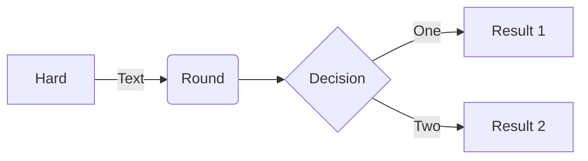

This plug adds basic [Mermaid](https://mermaid.js.org/) support to Silver Bullet.

For example:



**Note:** Uses [beautiful-mermaid](https://github.com/lukilabs/beautiful-mermaid) for server-side SVG rendering — no internet connection required.

## Configuration
You can use the `mermaid` config to customize appearance:

    ```space-lua
    config.set("mermaid", {
      -- Built-in theme (tokyo-night, catppuccin, nord, dracula, github-light, github-dark, etc.)
      theme = "tokyo-night",

      -- Or individual color overrides:
      bg = "#1a1b26",
      fg = "#a9b1d6",
    })
    ```

