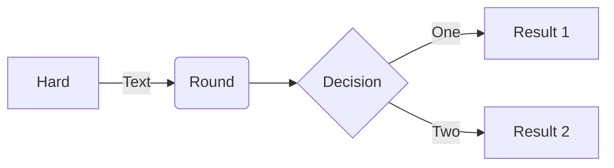

# Silver Bullet plug for Mermaid diagrams
This plug adds basic [Mermaid](https://mermaid.js.org/) support to Silver Bullet.

For example:



**Note:** this plug is compatible with SilverBullet v2.

**Note:** This plug uses [beautiful-mermaid](https://github.com/lukilabs/beautiful-mermaid) to render diagrams server-side as SVG — no CDN or internet connection required.

## Installation
In your CONFIG page, add the mermaid plug, e.g.:

    ```space-lua
    config.set {
      plugs = {
        "github:silverbulletmd/silverbullet-mermaid/mermaid.plug.js"
      }
    }
    ```

Then run the `Plugs: Update` command.


## Use

Put a mermaid block in your markdown:

    ```mermaid
    flowchart TD
        Start --> Stop
    ```

And move your cursor outside of the block to live preview it!

## Configuration

You can use the `mermaid` config to customize the appearance:

    ```space-lua
    config.set("mermaid", {
      -- Use a built-in theme (tokyo-night, catppuccin, nord, dracula, github-light, github-dark, etc.)
      theme = "tokyo-night",

      -- Or override individual colors:
      bg = "#1a1b26",
      fg = "#a9b1d6",
      line = "#3d59a1",
      accent = "#7aa2f7",
      muted = "#565f89",
      surface = "#292e42",
      border = "#3d59a1",

      -- Layout options:
      font = "Inter",
      padding = 40,
      nodeSpacing = 24,
      layerSpacing = 40,
    })
    ```

Built-in themes: `tokyo-night`, `catppuccin`, `nord`, `dracula`, `github-light`, `github-dark`, `solarized`, and more (15 total).

